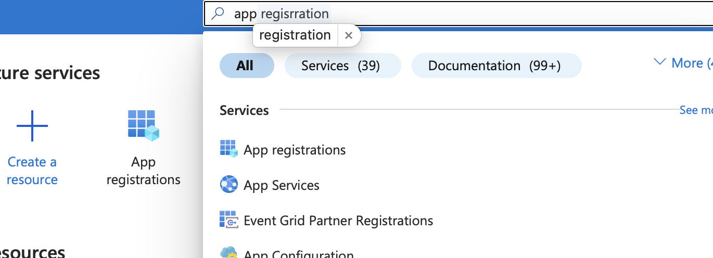

# Streamlit-MSAL-2: Yet Another MSAL for Streamlit


[](https://github.com/psf/black)

## Motivation

This is a workaround for streamlit to use msal authentication process in an enterprise environment, which in many cases using **ConfidentialClientApplication**, and requiring checking user roles.

## How to Install

```bash
pip install streamlit-msal-2
```

## How It Works

* this package is using [streamlit-msal](https://github.com/WilianZilv/streamlit_msal) in the background for the authentication.
    * however, [streamlit-msal](https://github.com/WilianZilv/streamlit_msal) does not specially integrate msal ConfidentialClientApplication, while this is usually mandatorily required by enterprise use cases
* to simplify enterprise use cases, this package adds some additional role checking after [streamlit-msal](https://github.com/WilianZilv/streamlit_msal) sign in
    * these required roles can be directly configured in the Microsoft Azure App registration.
    * by assigning user roles in App registration enterprise configuration, the authentication
process can automatically check the signed in user's App roles, if it fulfills the predefined user roles, users can go further in streamlit

## How to Configure and Use

### Configure Azure App Registration

* go Microsoft [Azure portal](https://portal.azure.com)
* search `App registration`, and click into it
* select an existing `App registration`, or create a new one if you do not have
    * 

* click to copy your `tenant id` and `client id`
    * 

* add `App roles`
    * 

* in `Authentication`, you have to add single-page application. for local test runs, if using streamlit default port, add `http://localhost:8501`

### Configure Enterprise Application

* go to `Enterprise Application` in `Overview` page
    * 

* add your target users, and remember to select the corresponding App roles you just created
    * 

### Streamlit Python Code

* run pip install

```bash
pip install streamlit-msal-2
```

* integrate the package in your streamlit code

```python
import streamlit as st
from streamlit_msal_2 import init_auth


st.title("Streamlit MSAL Example")

client_id = "your_client_id"
tenant_id = "your_tenant_id"
user_roles = {
    "ExampleApp.Admin": "ExampleApp.Admin",
    "ExampleApp.User": "ExampleApp.User",
}

init_auth(user_roles, tenant_id, client_id)

st.write(f"Welcome, {st.session_state.username}")
```

Details check [example folder](https://github.com/xiepei1/streamlit-msal-2/tree/main/docs/example)

## Known Issues and Limitations

* the client_secret is not actually integrated into the process, the [streamlit-msal](https://github.com/WilianZilv/streamlit_msal) package is in the background using PublicClientApplication sign in process. yet by defining the required App roles of user, it still can work to certain extend to make sure the sign-in user is the actually the target user
